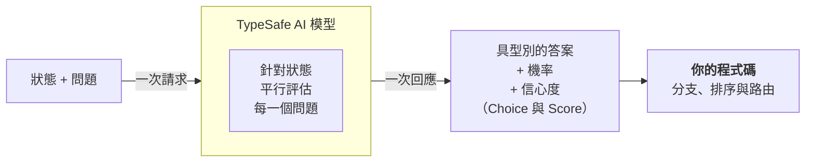

> 本文件是 [`introduction.md`](introduction.md)（來源：<https://docs.typesafe.ai/introduction.md>，下載於 2026-09-23）的繁體中文翻譯，供人類閱讀參考。
> 若內容有出入，以線上英文版本為準。

> ## 文件索引
> 完整的文件索引請見：https://docs.typesafe.ai/llms.txt（中文版：[llms.zh.md](../llms.zh.md)）
> 在深入探索之前，可先用這份索引了解所有可用的頁面。

# 簡介

> Jev 是 TypeSafe 的旗艦模型，也是第一個 System One 模型。送出狀態與具型別的問題，即可取得程式碼能直接使用的結構化答案。

大型語言模型（LLM）的設計目的是產生給人閱讀的文字。當你需要模型做出一個「由程式碼取用」的判斷時，就會出現不匹配：你得硬逼一個文字生成系統輸出結構化的決策，再把結果解析回程式碼可以依賴的形式。

Jev 是 TypeSafe 的旗艦模型，也是第一個 [System One 模型](concepts/system-one.zh.md)。System One 模型專為做出快速、結構化、可讓軟體直接使用的決策而打造。Jev 會針對一份*狀態（state）*評估具型別的*問題（question）*，並直接回傳結構化的結果。不生成文字，也不需要解析。你拿到的是具型別的值與機率分布，程式碼可以據此分支、排序與路由。Choice 與 Score 還會回傳[信心度（confidence）](confidence.zh.md)，程式碼可以用它來決定是否要依據某個答案採取行動、以及如何行動。

## TypeSafe 原語

TypeSafe 提供三種 *AI 原語（AI primitives）*。就像軟體中的原語一樣，我們的 AI 原語具備模組化、可組合、結構化、可靠且快速的特性。每一種原語提出不同類型的*問題*，並回傳不同類型的答案。

| 問題類型 | 目標 | 回傳 |
| --- | --- | --- |
| [Choice](primitives/choice.zh.md) | 從清單中選出一個選項 | `choice`、`probabilities`、`confidence` |
| [Score](primitives/score.zh.md) | 依評分量表替狀態評分 | `score`、`probabilities`、`confidence` |
| [Noul](primitives/noul.zh.md) | 這個敘述是真的嗎？ | `noul`（0–1） |

三種*問題*類型可以混合放在同一次 API 呼叫中。所有*問題*都會一次性地、平行且彼此隔離地針對同一份*狀態*進行評估。增加問題幾乎不會影響回應時間。由於每個問題都是獨立評估的，增加問題數量也不會造成上下文劣化（context-rot）。

## 原子化的問題，在程式碼中組合

當每個問題只問一件具體、範圍明確的事情時，System One 模型的表現最好。把每個問題想成一次「直覺判斷」：也就是一位知識豐富的人，在拿到正確上下文後，幾秒鐘內就能做出的那種判斷。

如果你想問的問題需要長時間推理，或需要權衡多個彼此獨立的因素，就把它拆解開來。將每個因素各自作為一個問題提出，再用程式碼中的邏輯組合結果。這樣每一次個別評估都能保持可靠，而你也能完全掌控各個維度的權重。

舉例來說，與其問「替這份新創提案評分」，不如分別詢問市場規模、技術可行性與差異化程度，再用你自己的公式組合這些分數。當優先順序改變時，只要調整程式碼中的一個係數，而不必重寫提示詞。

## 下一步

* [快速開始](introduction/quickstart.zh.md)：立即上手所需的一切。
* [AI 入門](https://docs.typesafe.ai/introduction/machine-learning-primer.md)：為什麼 TypeSafe 訓練的是做出校準決策的模型，而不是生成文字的模型。
* [原語（問題）](primitives.zh.md)：如何定義問題、如何在 Choice、Score 與 Noul 之間選擇，以及如何一次提出多個問題。
* [信心度](confidence.zh.md)：TypeSafe 如何回報確定程度，以及如何在架構層面運用它。
* [模式](https://docs.typesafe.ai/patterns.md)：使用 TypeSafe 建置系統的常見模式。
