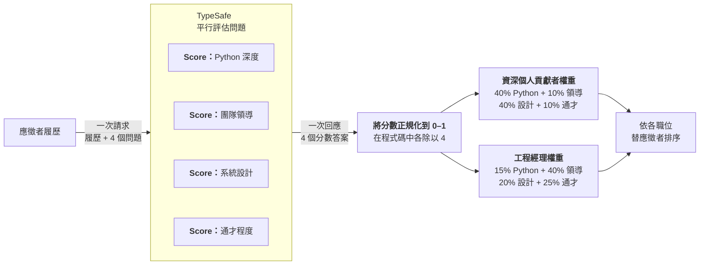

> 本文件是 [`composite-scoring.md`](composite-scoring.md)（來源：<https://docs.typesafe.ai/patterns/composite-scoring.md>，下載於 2026-09-23）的繁體中文翻譯，供人類閱讀參考。
> 若內容有出入，以線上英文版本為準。程式碼保持原文，範例中的英文字串另附中文對照。
> 原文開頭有一段網站用來產生 Playground 連結的 JavaScript 元件（`TypesafeExample`），與內容無關，本譯文已省略。

> ## 文件索引
> 完整的文件索引請見：https://docs.typesafe.ai/llms.txt（中文版：[llms.zh.md](../../llms.zh.md)）
> 在深入探索之前，可先用這份索引了解所有可用的頁面。

# 複合評分（Composite scoring）

> 將複雜的判斷拆解成原子化的分數，再用程式碼中可控的權重加以組合。

我們常常想依據多項標準同時替一組項目排序。複合評分是思考這件事的簡單方式：把判斷拆成彼此獨立的維度，分別替每個維度評分，再用你在程式碼中掌控的權重把它們組合起來。

## 範例：履歷篩選

假設你正在處理工程職缺的履歷。你想依據多項標準替應徵者排序，最終選出前 X 名進入下一輪審查。



### 步驟 1：分別替每個維度評分

**questions**

```json
{
  "python_depth": {
    "type": "score",
    "instructions": "How much depth of python experience does this candidate have, based on the supplied resume?",
    "criteria": [
      "No Python experience mentioned",
      "Mentioned but no detail",
      "Used in projects, some specifics",
      "Primary language, multiple projects",
      "Deep expertise: architecture, performance, libraries"
    ]
  },
  "team_leadership": {
    "type": "score",
    "instructions": "How much experience does this candidate have managing or leading engineering teams?",
    "criteria": [
      "No management experience mentioned",
      "Informal mentorship or tech lead role",
      "Led a small team or project",
      "Managed a team with direct reports",
      "Managed multiple teams or an engineering org"
    ]
  },
  "system_design": {
    "type": "score",
    "instructions": "How much experience does this candidate have designing large-scale or distributed systems?",
    "criteria": [
      "No architecture work mentioned",
      "Contributed to design discussions",
      "Designed components of a larger system",
      "Owned architecture of a significant system",
      "Designed systems at scale across multiple domains"
    ]
  },
  "generalist": {
    "type": "score",
    "instructions": "How much evidence is there that this candidate picks up unfamiliar tools, roles, or domains outside their core specialty?",
    "criteria": [
      "Only one domain or role mentioned",
      "Some variety but within a narrow field",
      "Worked across a few different areas or tech stacks",
      "Regularly moved between domains, wore many hats",
      "Track record of ramping up in unfamiliar areas and delivering"
    ]
  }
}
```

> 中文對照：
> - `python_depth`（Python 深度）：「根據所提供的履歷，這位應徵者的 Python 經驗有多深？」
>   - 等級 0：未提及任何 Python 經驗
>   - 等級 1：有提到，但沒有細節
>   - 等級 2：在專案中使用過，有一些具體內容
>   - 等級 3：主要使用語言，多個專案
>   - 等級 4：深厚專業：架構、效能、函式庫
> - `team_leadership`（團隊領導）：「這位應徵者在管理或帶領工程團隊方面有多少經驗？」
>   - 等級 0：未提及任何管理經驗
>   - 等級 1：非正式的指導，或技術負責人（tech lead）角色
>   - 等級 2：帶領過小型團隊或專案
>   - 等級 3：管理過有直屬部屬的團隊
>   - 等級 4：管理過多個團隊或整個工程組織
> - `system_design`（系統設計）：「這位應徵者在設計大規模或分散式系統方面有多少經驗？」
>   - 等級 0：未提及任何架構工作
>   - 等級 1：參與過設計討論
>   - 等級 2：設計過大型系統中的元件
>   - 等級 3：負責過重要系統的架構
>   - 等級 4：跨多個領域設計過大規模系統
> - `generalist`（通才程度）：「有多少證據顯示這位應徵者能掌握核心專長以外、不熟悉的工具、角色或領域？」
>   - 等級 0：只提到單一領域或角色
>   - 等級 1：有些變化，但仍在狹窄的領域內
>   - 等級 2：曾跨足幾個不同領域或技術堆疊
>   - 等級 3：經常在不同領域間轉換，身兼多職
>   - 等級 4：有在不熟悉領域中快速上手並交出成果的實績
>
> 原網頁在此範例下方有「Try it in the Playground →」連結，可在 [Playground](https://console.typesafe.ai/playground) 中直接試用（此範例未附狀態，可自行貼上一份履歷文字作為狀態）。

### 步驟 2：用權重組合

每個維度都先正規化到 0–1，再加上權重。權重讓你能輕鬆調整各維度的相對重要性，同時不會失去個別分數中的任何細節。

**scoring.py**

```python
py      = response.answers["python_depth"].score / 4
lead    = response.answers["team_leadership"].score / 4
arch    = response.answers["system_design"].score / 4
general = response.answers["generalist"].score / 4

# Senior IC
ic_score = (0.40 * py) + (0.10 * lead) + (0.40 * arch) + (0.10 * general)

# Engineering Manager
em_score = (0.15 * py) + (0.40 * lead) + (0.20 * arch) + (0.25 * general)
```

> 中文對照：
> - 每個 Score 有 5 個等級（0～4），所以除以 4 就能把分數正規化到 0～1。
> - `# Senior IC`：資深個人貢獻者（Individual Contributor，不帶人的資深工程師）的權重：Python 40%、領導 10%、設計 40%、通才 10%。
> - `# Engineering Manager`：工程經理的權重：Python 15%、領導 40%、設計 20%、通才 25%。
> - 兩組權重的總和都是 100%，所以組合後的分數同樣落在 0～1。

這讓你能依據複合分數替應徵者排序。但更重要的是，它讓你清楚看見最終分數究竟是怎麼算出來的。如果排名最前面的應徵者不符合你的預期，你可以調整權重，找出適當的平衡。
