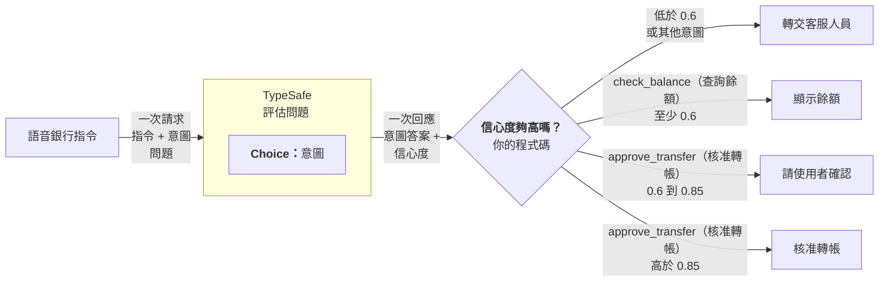

> 本文件是 [`confidence-routing.md`](confidence-routing.md)（來源：<https://docs.typesafe.ai/patterns/confidence-routing.md>，下載於 2026-09-23）的繁體中文翻譯，供人類閱讀參考。
> 若內容有出入，以線上英文版本為準。程式碼保持原文，範例中的英文字串另附中文對照。
> 原文開頭有一段網站用來產生 Playground 連結的 JavaScript 元件（`TypesafeExample`），與內容無關，本譯文已省略。

> ## 文件索引
> 完整的文件索引請見：https://docs.typesafe.ai/llms.txt（中文版：[llms.zh.md](../../llms.zh.md)）
> 在深入探索之前，可先用這份索引了解所有可用的頁面。

# 信心度門檻路由（Confidence-gated routing）

> 把信心度當成第二個維度。答案告訴你「是什麼」，信心度告訴你「要不要行動」。

TypeSafe 最強大的功能之一就是[信心度（confidence）](../confidence.zh.md)。只要刻意地依據信心度來把關決策，你就能打造既可靠又安全的系統。

## 範例：語音銀行指令

假設你正在建置一個語音銀行介面，讓使用者能用說話的方式操作自己的帳戶。雖然你總是希望對使用者意圖的解讀有合理的信心，但某些動作的風險比其他動作高，因此需要更高的信心度門檻。



### 步驟 1：判斷使用者的意圖

**questions**

```json
{
  "intent": {
    "type": "choice",
    "instructions": "What action is the user requesting?",
    "criteria": {
      "check_balance": "Check the balance of an account",
      "approve_transfer": "Approve the pending transfer request",
      "other": "Something else"
    }
  }
}
```

> 中文對照：
> - `intent`（Choice）：「使用者要求執行什麼動作？」
>   - `check_balance`（查詢餘額）：查詢某個帳戶的餘額
>   - `approve_transfer`（核准轉帳）：核准待處理的轉帳請求
>   - `other`（其他）：其他事情
>
> 原網頁在此範例下方有「Try it in the Playground →」連結，可在 [Playground](https://console.typesafe.ai/playground) 中直接試用（此範例未附狀態，可自行輸入一句語音指令的文字作為狀態）。

### 步驟 2：信心度門檻路由

```python
action = response.answers["intent"]

# Below 0.6 confidence on any action, route to a human
if action.confidence < 0.6:
    route_to_support_agent(account_id)

elif action.choice == "check_balance":
    # Low stakes. 0.6 confidence is sufficient.
    show_balance(account_id)

elif action.choice == "approve_transfer":
    if action.confidence > 0.85:
        # High stakes, but high confidence. Safe to act automatically.
        approve_transfer(account_id)
    else:
        # High stakes, moderate confidence. Verify intent first.
        ask_user_to_confirm("Just to confirm: you would like to approve this transfer, is that correct?")

else:
    route_to_support_agent(account_id)
```

> 中文對照（程式註解與字串）：
> - 「任何動作的信心度低於 0.6，就轉交人工」→ 轉給客服人員（`route_to_support_agent`）
> - `check_balance`（查詢餘額）：「風險低。0.6 的信心度就足夠。」→ 顯示餘額（`show_balance`）
> - `approve_transfer`（核准轉帳）且信心度 > 0.85：「風險高，但信心度也高。可以安全地自動執行。」→ 核准轉帳（`approve_transfer`）
> - `approve_transfer`（核准轉帳）且信心度 ≤ 0.85：「風險高、信心度中等。先確認意圖。」→ 請使用者確認（`ask_user_to_confirm`），詢問內容：「跟您確認一下：您是要核准這筆轉帳，對嗎？」
> - 其他情況（例如 `other`）：轉給客服人員

0.6 的下限會攔下模型真正不確定的所有情況。在這個下限之上，每一種動作都依據「根據錯誤分類而行動」的後果，設定自己的門檻。以 0.6 的信心度查詢餘額沒問題，因為最壞的情況只是使用者得聽一遍餘額播報。但核准轉帳需要非常高的信心度（> 0.85），否則系統應該先請使用者確認。

關於如何在系統中思考信心度，更多細節請見[信心度](../confidence.zh.md)。
