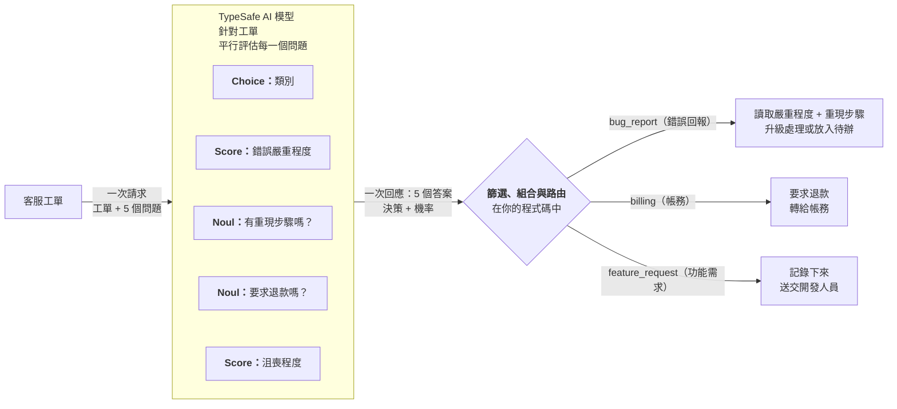

> 本文件是 [`fan-out.md`](fan-out.md)（來源：<https://docs.typesafe.ai/patterns/fan-out.md>，下載於 2026-09-23）的繁體中文翻譯，供人類閱讀參考。
> 若內容有出入，以線上英文版本為準。程式碼保持原文，範例中的英文字串另附中文對照。
> 原文開頭有一段網站用來產生 Playground 連結的 JavaScript 元件（`TypesafeExample`），與內容無關，本譯文已省略。

> ## 文件索引
> 完整的文件索引請見：https://docs.typesafe.ai/llms.txt（中文版：[llms.zh.md](../../llms.zh.md)）
> 在深入探索之前，可先用這份索引了解所有可用的頁面。

# 推測式扇出（Speculative fan-out）

> 在單一呼叫中送出多個問題（包括推測性的問題），再由程式碼決定哪些答案相關。

由於 TypeSafe 支援在單一 API 呼叫中送出多個問題，我們建議把系統需要的所有問題都放進同一次請求中，事後再用程式碼決定哪些答案相關。所有問題都是平行評估的，因此增加問題通常對回應時間影響很小。

## 範例：客服工單分流

假設你正在建置一個需要替客服工單分流的客服系統。你需要把工單分類到某個類別；如果它是錯誤回報，你還需要判斷這個錯誤的嚴重程度。

與其先詢問類別、再用後續呼叫詢問嚴重程度，你可以同時詢問兩者。如果工單不是錯誤回報，只要忽略錯誤嚴重程度這個問題的結果即可。



### 步驟 1：推測式扇出

**questions**

```json
{
  "category": {
    "type": "choice",
    "instructions": "Determine the broad category of this support ticket",
    "criteria": {
      "bug_report": "The user is reporting something that is broken or producing errors",
      "billing": "Charges, invoices, refunds, subscriptions",
      "feature_request": "The user is requesting new functionality",
      "account": "Login, permissions, profile, security"
    }
  },
  "bug_severity": {
    "type": "score",
    "instructions": "How severe is the reported issue",
    "criteria": [
      "Cosmetic; no impact to functionality",
      "Broken or degraded feature; workaround exists",
      "Blocking issue; no workaround exists"
    ]
  },
  "has_reproducible_steps": {
    "type": "noul",
    "instructions": "The user describes specific steps to reproduce the issue"
  },
  "refund_requested": {
    "type": "noul",
    "instructions": "The user is explicitly asking for a refund or credit"
  },
  "frustration": {
    "type": "score",
    "instructions": "How frustrated the user appears",
    "criteria": ["Calm, matter-of-fact", "Frustrated but civil", "Very angry"]
  }
}
```

原網頁在 Playground 中試用此範例時所用的狀態（state）：

```json
"Hi, I placed an order (#98423) last Thursday and was charged twice. I also can't log in after the site update, and adding Apple Pay would be really helpful. This is getting frustrating."
```

> 中文對照：
> - 狀態：「嗨，我上週四下了一筆訂單（#98423），結果被扣款兩次。網站更新後我也無法登入，另外如果能加入 Apple Pay 會很有幫助。這真的越來越讓人沮喪了。」
> - `category`（Choice）：「判斷這張客服工單的大致類別」
>   - `bug_report`（錯誤回報）：使用者回報某個東西壞了或產生錯誤
>   - `billing`（帳務）：扣款、發票、退款、訂閱
>   - `feature_request`（功能需求）：使用者要求新功能
>   - `account`（帳號）：登入、權限、個人資料、安全性
> - `bug_severity`（Score）：「所回報的問題有多嚴重」
>   - 等級 0：外觀問題；不影響功能
>   - 等級 1：功能損壞或效能下降；有替代方案
>   - 等級 2：阻斷性問題；沒有替代方案
> - `has_reproducible_steps`（Noul）：「使用者描述了重現問題的具體步驟」
> - `refund_requested`（Noul）：「使用者明確要求退款或抵用額度」
> - `frustration`（Score）：「使用者看起來有多沮喪」
>   - 等級 0：冷靜、就事論事
>   - 等級 1：沮喪但仍有禮貌
>   - 等級 2：非常憤怒
>
> 原網頁在此範例下方有「Try it in the Playground →」連結，可在 [Playground](https://console.typesafe.ai/playground) 中直接試用。

> **注意——推測性的問題：** `bug_severity` 與 `has_reproducible_steps` 只有在工單是錯誤回報時才重要；`refund_requested` 只對帳務類有意義。我們把它們全部預先放進去，是因為額外的問題通常對回應時間影響很小。如果工單最後是功能需求，錯誤嚴重程度的結果就無關緊要，這時你的程式路徑直接忽略它即可。

### 步驟 2：用程式碼路由

你的程式碼根據分類結果決定哪些答案相關：

**triage.py**

```python
category = response.answers["category"]
bug_severity = response.answers["bug_severity"]
bug_repro = response.answers["has_reproducible_steps"]
refund = response.answers["refund_requested"]
frustration = response.answers["frustration"]

if category.choice == "bug_report":
    if bug_severity.score > 1.5 and bug_repro.noul > 0.6:
        escalate_to_engineering(ticket_id, severity="high")
    else:
        add_to_bug_backlog(ticket_id)

elif category.choice == "billing":
    if refund.noul > 0.7:
        route_to_billing_with_flag(ticket_id, refund_likely=True)
    else:
        route_to_billing(ticket_id)

elif category.choice == "feature_request":
    log_feature_request(ticket_id)

# Frustration is useful regardless of category
if frustration.score > 1.5:
    flag_for_priority_response(ticket_id)
```

> 中文對照（程式邏輯）：
> - 若類別是 `bug_report`（錯誤回報）：嚴重程度 > 1.5 **且**有重現步驟的機率 > 0.6，就以高嚴重度升級給工程團隊（`escalate_to_engineering`）；否則放入錯誤待辦清單（`add_to_bug_backlog`）。
> - 若類別是 `billing`（帳務）：要求退款的機率 > 0.7，就轉給帳務並標記「很可能要退款」（`route_to_billing_with_flag`）；否則一般轉給帳務（`route_to_billing`）。
> - 若類別是 `feature_request`（功能需求）：記錄這項功能需求（`log_feature_request`）。
> - 註解「Frustration is useful regardless of category」：不論類別為何，沮喪程度都有用。沮喪程度 > 1.5 時，標記為優先回覆（`flag_for_priority_response`）。

整個決策樹所需的一切，都來自同一次呼叫。推測性的問題在不相關時被忽略；在相關時，則省下了一次來回的請求。
